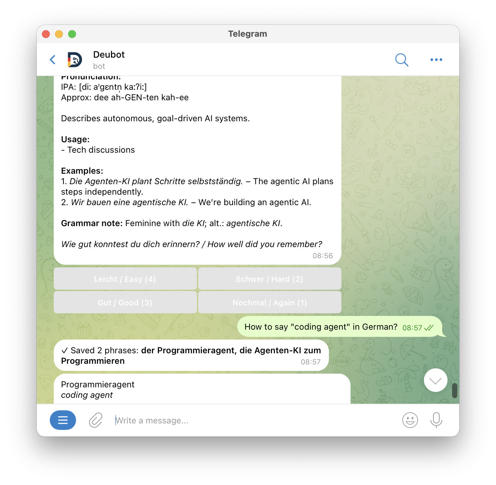

# DeuBot

**Primary goal**: Explore capabilities and limitations of coding with AI coding assistants (Claude Code, Cursor, etc.) rather than build production-ready software.

*This README was written by an AI coding assistant.*



## What It Is

A German learning Telegram bot with spaced repetition. Built iteratively with Claude Code to test agent-driven development workflows. The bot itself is an AI agent (OpenAI) that uses tool calling for translation, phrase storage, and spaced repetition reviews—showing buttons in Telegram UI through tools, not hardcoded commands.

## Design

**Agent architecture**: OpenAI integration with structured tool calling. Tools have elaborate descriptions following Claude Code's documentation philosophy (see [Decoding Claude Code](https://minusx.ai/blog/decoding-claude-code/)). Agent returns typed outputs using dataclasses, not magic strings.

**Spaced repetition**: SM-2 algorithm with gzip-compressed JSON persistence. Quality ratings (1-4: Again, Hard, Good, Easy) adjust ease factors and intervals. Duplicate detection uses trigram similarity.

**Deployment**: Systemd service with Type=notify protocol for proper startup signaling. Deployed via rsync to remote host.

**Stack**: Python 3.13, `uv` for dependencies, Telegram Bot API, OpenAI GPT.

## Testing & Development

Tests use pytest markers:
- **Unit tests** (`@pytest.mark.unit`): Fast tests for SM-2 algorithm, database, similarity detection (< 1 second)
- **LLM tests** (`@pytest.mark.llm`): Integration tests with actual OpenAI API calls, run in parallel with `-n 20`

LLM tests validate behavior patterns and semantic correctness, not exact string matches.

```bash
make lint   # Run all linters
make run    # Run locally
make deploy # Deploy to remote systemd service
```

## Structure

`deubot/main.py` - Application entry point
`deubot/agent.py` - AI agent with tool calling and typed outputs
`deubot/tools.py` - Tool definitions with detailed documentation
`deubot/translations.py` - Parallel LLM translation card generation with caching
`deubot/review_session.py` - Review session state machine
`deubot/bot.py` - Telegram handler with callback queries for reviews
`deubot/database.py` - SM-2 spaced repetition storage with duplicate detection
`deubot/systemd.py` - Type=notify service integration

Configuration via `.env` file (see `.env.example`).
